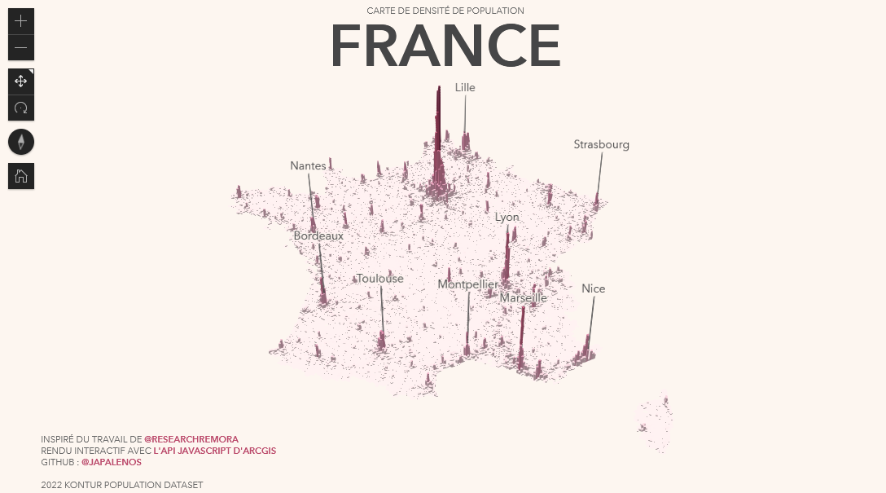

# Densité de population en France

Cette application rend interactive la [carte de densité de population de la France](https://japalenos.github.io/JS-API/Densite-de-Population-FRA/) de [@ResearchRemora](https://twitter.com/researchremora?ref_src=twsrc%5Egoogle%7Ctwcamp%5Eserp%7Ctwgr%5Eauthor). Elle utilise les données du recensement du Kontur Population Dataset de 2022.

L'application a été réalisée avec l'[API JavaScript d'ArcGIS](https://developers.arcgis.com/javascript/latest/).

Vous pouvez retrouver l'[article CodeTheMap](https://www.codethemap.fr/2023/02/un-mardi-une-appli-23-utiliser-des-gros.html) pour plus de discussion autour de l'utilisation de gros volumes de données dans la carto web.

