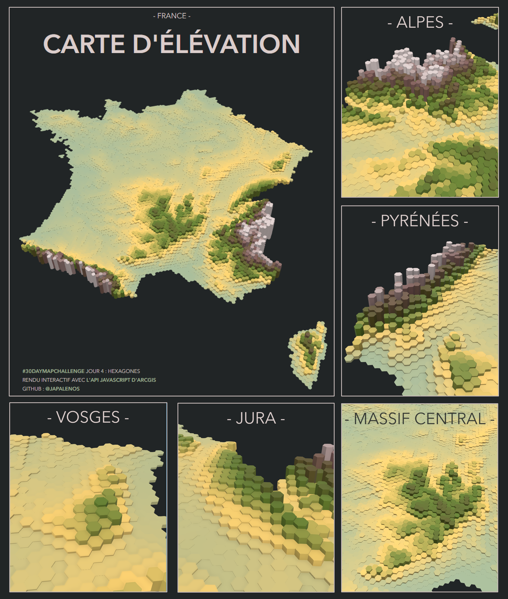

**[30DaysMapChallenge](https://30daymapchallenge.com/)**
**04-11-2024 	Hexagons** 	 
Maps using hexagonal grids. Step away from square grids and try mapping with hexagons. A fun way to show density or spatial patterns. 🔷  
Explore the elevation of France, in a map that looks like a video game.  
  

