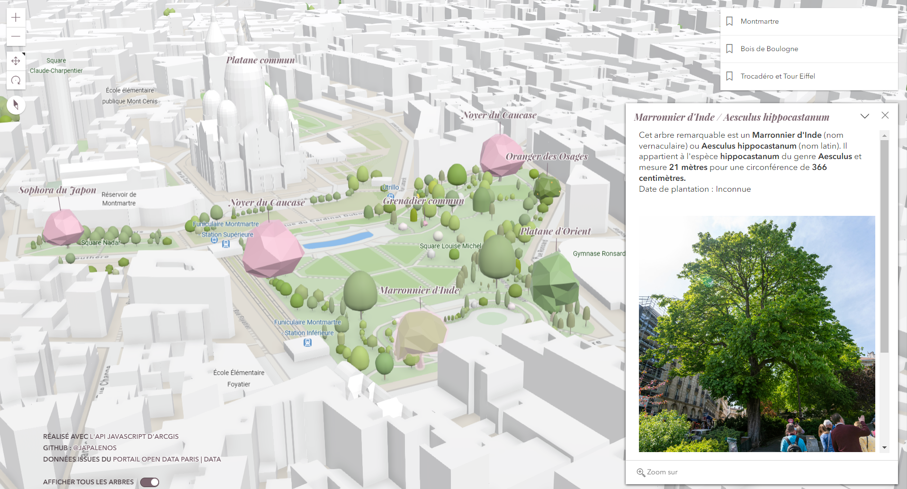

# Jardins Parisiens

A travers [cette application](https://japalenos.github.io/JS-API/Jardins-Parisiens/), je vous propose de partir à la découverte des **arbres remarquables de la capitale**.
Dans une [**série de huit tutoriels sur mon blog CodeTheMap**](https://www.codethemap.fr/2023/07/prise-en-main-de-lapi-javascript-intro.html), vous pouvez découvrir pas à pas comment créer ce type d'application cartographique web en utilisant l'[**API JavaScript d'ArcGIS**](https://developers.arcgis.com/javascript/latest/).

