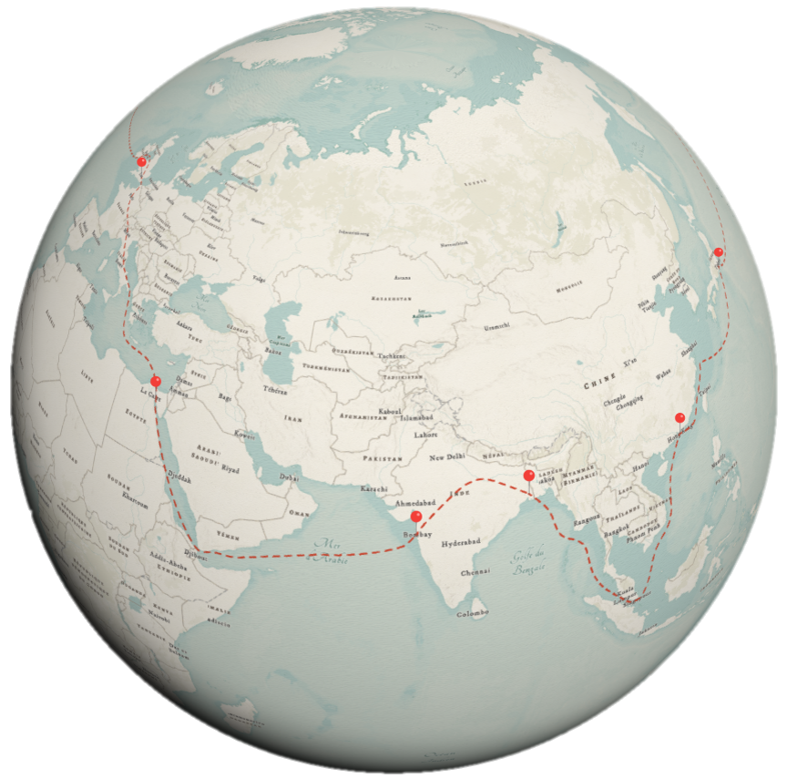

# Le Tour du Monde en 80 Jours

Via cette application, je voulais mettre à l'honneur [Le Tour du Monde en 80 Jours](https://japalenos.github.io/JS-API/Le-Tour-du-Monde-en-80-Jours/), célèbre roman de **Jules Vernes** sorti il y a tout pile 150 ans. En 3D, vous pouvez retracer le parcours de Phileas Fogg et de ses compagnons de routes, redécouvrir les villes qu'ils ont traversées, les péripéties qu'ils ont vécues et les moyens de transport qu'ils ont empruntés autour du globe.

L'application a été réalisée avec l'[API JavaScript d'ArcGIS](https://developers.arcgis.com/javascript/latest/) et permet de mettre en application une des fonctionnalités phares de la [version 4.25 de l'API](https://developers.arcgis.com/javascript/latest/4.25/), à savoir la possibilité d'[afficher des enregistrements associés dans les fenêtres contextuelles](https://developers.arcgis.com/javascript/latest/api-reference/esri-popup-content-RelationshipContent.html).

Vous pouvez retrouver l'[article CodeTheMap](https://www.codethemap.fr/2022/12/un-mardi-une-appli-22-le-tour-du-monde.html) pour comprendre comment cette application a été construite.

