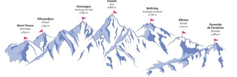

# Les Sept Sommets

Les septs sommets (Seven Summit) sont un challenge mythique de l’alpinisme consistant à gravir le sommet de chacun des sept continents : le Mont Vinson (Antarctique), le Kilimandjaro (Afrique), l’Aconcagua (Amérique du Sud), l’Everest (Asie), le Denali aussi appelé McKinley (Amérique du Nord), l’Elbrouz (Europe) et le Puncak Jaya aussi connu sous le nom de Pyramide de Carstensz (Océanie).  

**Inspiration**: [John Nelson](https://twitter.com/John_M_Nelson) showed me this [awesome project](https://www.sketchnthecity.com/) and we were wondering whether we could create a similar effect using the [sketch edges](https://developers.arcgis.com/javascript/latest/api-reference/esri-symbols-edges-SketchEdges3D.html) feature of the ArcGIS API for JavaScript. This project is what came out.
