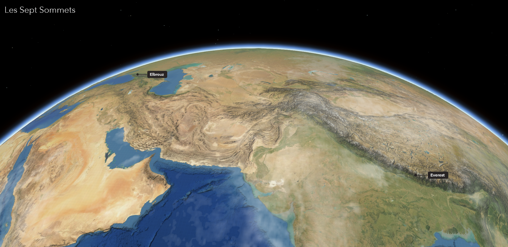

# Les Sept Sommets

Les [Sept Sommets](https://japalenos.github.io/JS-API/) sont un challenge mythique de l’alpinisme consistant à gravir le sommet de chacun des sept continents : le **Mont Vinson** (Antarctique), le **Kilimandjaro** (Afrique), l’**Aconcagua** (Amérique du Sud), l’**Everest** (Asie), le **Denali** aussi appelé McKinley (Amérique du Nord), l’**Elbrouz** (Europe) et le **Puncak Jaya** aussi connu sous le nom de Pyramide de Carstensz (Océanie).  

L'application a été réalisée avec l'[API JavaScript d'ArcGIS](https://developers.arcgis.com/javascript/latest/).

**Inspiration**: Cette application est une version simplifiée des [Five Deeps](https://geoxc-apps4.bd.esri.com/five-deeps/) (les cinq profondeurs) réalisée par [Raluca Nicola](https://github.com/RalucaNicola)
