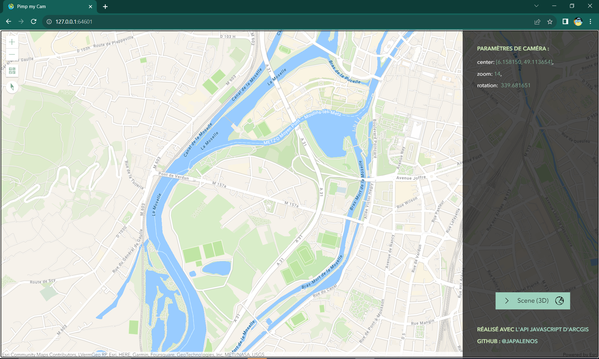

# Pimp my cam

*[EN]*
[This app](https://japalenos.github.io/JS-API/Map-location-parameters) is design to help you retrieve the **location parameters** (center, rotation, zoom) you need when setting up a map using the [**ArcGIS JavaScript API**](https://developers.arcgis.com/javascript/latest/). You can navigate through the scene and copy/paste the camera parameters once you have found the ideal viewpoint for your app. Note that can also change the basemap if needed. Find [here](https://japalenos.github.io/JS-API/Scene-Camera-Parameters) the 3D equivalent for this app. 

*[FR]*
[Cette application](https://japalenos.github.io/JS-API/Map-location-parameters) est faite pour vous aider à retrouver les **paramètres de localisation** (centre, rotation, zoom) dont vous avez besoin lorsque vous configurez une carte avec l'[ArcGIS JavaScript API](https://developers.arcgis.com/javascript/latest/). Vous pouvez naviguer à travers la scène puis copier/coller les paramètres de caméra une fois que vous avez trouvé l'angle de vue idéal pour votre application. Notez que vous pouvez également changer le fond de carte si nécessaire. Retrouvez [ici](https://japalenos.github.io/JS-API/Scene-Camera-Parameters) l'équivalent 3D de cette application. Découvrez l'[article CodeTheMap associé](https://www.codethemap.fr/2023/09/parametres-camera-scene-3D.html).

