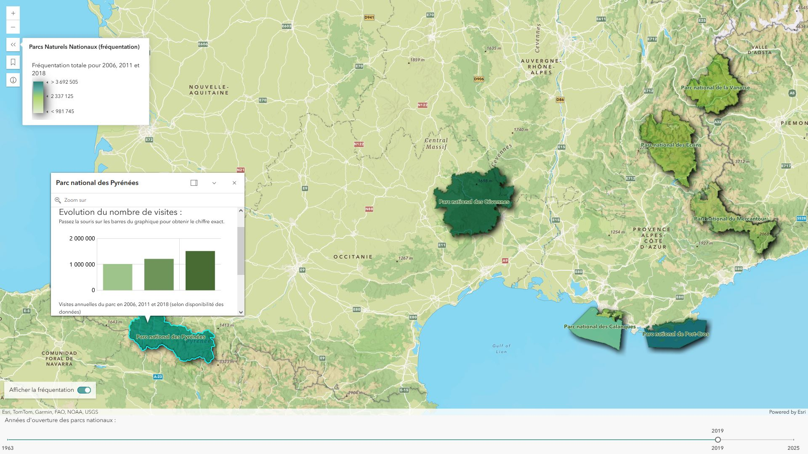

Les **Parcs nationaux de France** sont des espaces naturels protégés, reconnus pour leur biodiversité exceptionnelle et leurs paysages préservés. Créé en 1963, le Parc national de la Vanoise fut le premier, suivi de neuf autres, répartis entre montagnes, littoral et forêts. Chaque parc possède une identité propre et attire des millions de visiteurs chaque année. Cette application vous permet de découvrir ces territoires uniques, leurs années de création et leurs données de fréquentation pour mieux planifier vos explorations.  

L'application a été réalisée avec le [SDK JavaScript d'ArcGIS](https://developers.arcgis.com/javascript/latest/), pour ajouter des capacités à une webmap ArcGIS en tirant parti des [Map components](https://developers.arcgis.com/javascript/latest/components/) ainsi que des composants du [Calcite Design System](https://developers.arcgis.com/calcite-design-system/).
