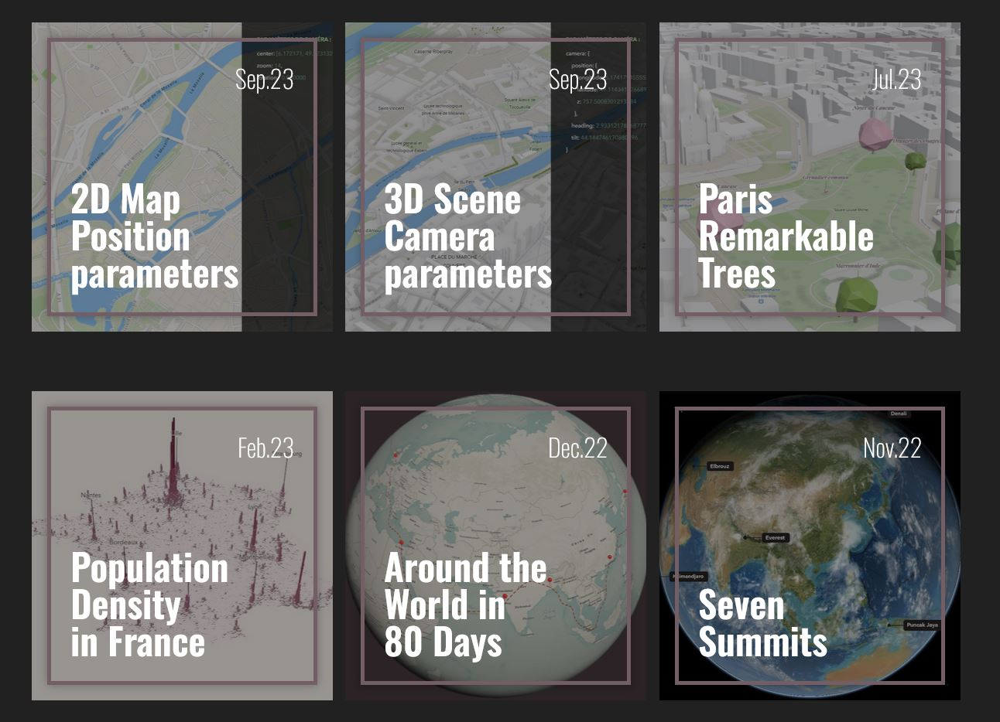

# ArcGIS Maps SDK for JavaScript - démos

L'[**ArcGIS Maps SDK for JavaScript**](https://developers.arcgis.com/javascript/latest/), aussi connu sous le nom de SDK JavaScript d'ArcGIS, est un SDK puissant permettant de créer des applications cartographiques web 2D et 3D.  

Vous pourrez trouver dans ce repo le code de différentes applications illustrant des capacités de l'API. 
Sur le blog [CodeTheMap](https://www.codethemap.fr/), vous pourrez retrouver des [articles expliquant la construction de chacune de ces applications](https://www.codethemap.fr/search/label/tutoriel?&max-results=3). 
Vous pouvez retrouver ci-dessous le showcase des applications disponibles.

