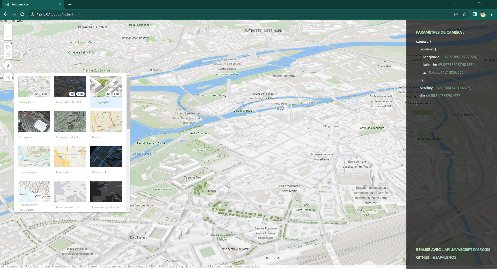

# Pimp my cam

*[EN]*
[This app](https://japalenos.github.io/JS-API/Scene-Camera-Parameters) is design to help you retrieve the **camera parameters** you need when setting up a scene using the [**ArcGIS JavaScript API**](https://developers.arcgis.com/javascript/latest/). You can navigate through the scene and copy/paste the camera parameters once you have found the ideal viewpoint for your app. Note that can also change the basemap if needed.

*[FR]*
[Cette application](https://japalenos.github.io/JS-API/Scene-Camera-Parameters) est faite pour vous aider à retrouver les paramètres de caméra dont vous avez besoin lorsque vous configurez une scène avec l'[ArcGIS JavaScript API](https://developers.arcgis.com/javascript/latest/). Vous pouvez naviguer à travers la scène puis copier/coller les paramètres de caméra une fois que vous avez trouvé l'angle de vue idéal pour votre application. Notez que vous pouvez également changer le fond de carte si nécessaire.

