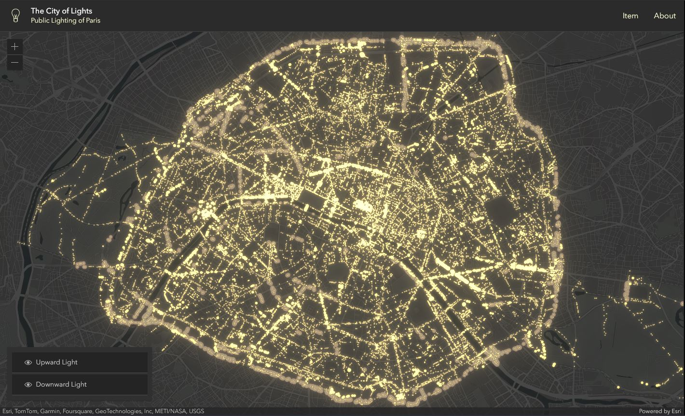

# The City of Lights

Paris est appelée la "Ville lumière" car elle a été a été l'une des premières villes du monde à adopter l'éclairage public à grande échelle, avec l'installation de réverbères au gaz au XIXe siècle. Cela a littéralement illuminé la ville la nuit, contribuant à l'association de Paris avec la lumière.
Cette application permet d'observer les lumières ascendantes et descendantes émises par les installations d'éclairage public de la capitale.

L'application a été réalisée avec le [SDK JavaScript d'ArcGIS](https://developers.arcgis.com/javascript/latest/), en tirant parti des [Map components](https://developers.arcgis.com/javascript/latest/components/) introduits en version 4.28, ainsi que des composants du [Calcite Design System](https://developers.arcgis.com/calcite-design-system/).
