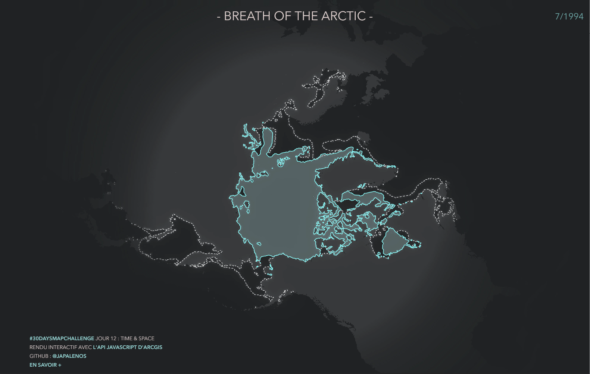

**[30DaysMapChallenge](https://30daymapchallenge.com/)**  
**12-11-2024 	Time and space** 	   
Map something where time matters. Visualize change over time—urban growth, migration, or environmental shifts. Show the relationship between time and geography. ⏳🌍  
Check how the Arctic expands and shrinks over months and years, much like a heartbeat or an agonizing breathing.

