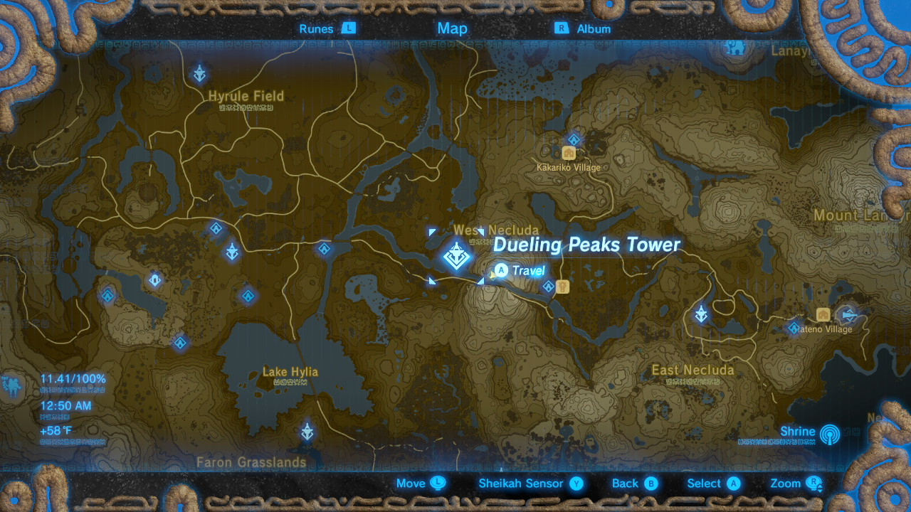

# My region's map but make it Breath of the Wild

Let's make a *map of your region* in the style of *Zelda Breath of the Wild's map*.
I'll be using the [ArcGIS API for JavaScript](https://openai.com/blog/chatgpt/) to make the map interactive.
Style ressources can be found on [Zelda Mods' Github](https://github.com/zeldamods) in the [objmap/public/icons/ repo](https://github.com/zeldamods/objmap/tree/master/public/icons).

